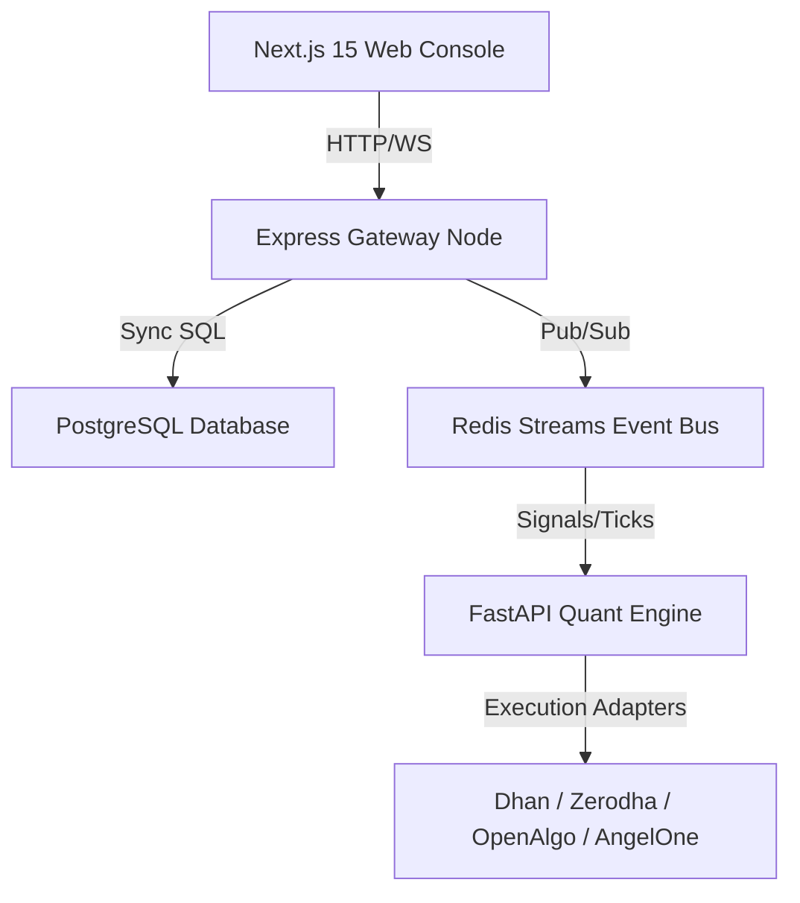

# Astra Quant Lab - Algorithmic Trading & Research Platform

An institutional-grade, microservice-based quantitative research and trading execution workspace designed for hedge funds, prop trading desks, and professional quantitative engineers.

---

## 1. System Architecture



---

## 2. Directory Layout

```
astra-quant-lab/
├── backend/            # Express gateway API (Authentication & SQL CRUD)
├── database/           # Relational migrations and Prisma ORM schemas
├── engine/             # FastAPI High Performance execution server & solvers
├── frontend/           # Next.js 15 Tailwind UI desktop-first terminal
├── strategies/         # Strategy sandbox dynamic plugins directory
└── warehouse/          # Log ledger store for auditing ticks/orders
```

---

## 3. Platform Capabilities

- **Market Data Service**: Centralized WebSocket connection pooler streaming ticks, Greeks, and order depths.
- **Microservice Event Bus**: Fully decoupled Redis Streams pub-sub system.
- **Multi-Broker Integrations**: Ready adapters for Dhan HQ, Zerodha Kite, OpenAlgo, and AngelOne SmartAPI.
- **Risk Management Service**: Math solver calculating Kelly Criterion and ATR position sizes alongside daily loss limits and holiday filters.
- **Portfolio Optimizer**: Solves correlation matrices and Efficient Frontier weights.
- **Backtesting & Monte Carlo Lab**: Out-of-sample Walk Forward Optimizations, parameter stability profiles, and random slippage simulations.
- **AI Research Copilot**: Quantitative NLP router explaining trade logs, drawdowns, and recommending sizing adjustments.

---

## 4. Quick Start Guide

### Environment Setup
Create a `.env` file inside `backend/` and `engine/` based on the corresponding `.env.example` templates.

### Docker Composition (Recommended)
Spin up the entire system (Database, Cache, API server, Quant Engine, Nginx proxy):
```bash
docker-compose up --build
```

### Manual Development Launch
1. **Prisma DB Migration**:
   ```bash
   cd database
   npx prisma db push
   ```
2. **Boot API Gateway**:
   ```bash
   cd backend
   npm run dev
   ```
3. **Boot Quant Engine**:
   ```bash
   cd engine
   .venv/bin/python -m uvicorn app.main:app --port 8000 --reload
   ```
4. **Boot Web Terminal**:
   ```bash
   cd frontend
   npm run dev
   ```

---

## 5. Development SDK
Astra includes a Python developer SDK allowing custom strategies and indicators plugins:
```python
from sdk import BaseQuantPlugin

class CustomStrategy(BaseQuantPlugin):
    def initialize(self, config):
        self.period = config.get("period", 14)
```

---

## 6. License & Contributions
Distributed under the MIT License. See [LICENSE](LICENSE) and [CONTRIBUTING.md](CONTRIBUTING.md) for guidelines.
