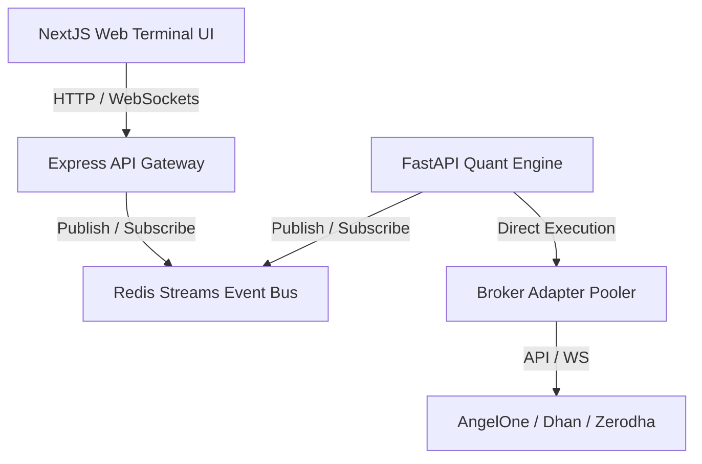

# IGRIS Architecture

IGRIS is an institutional-grade, AI-powered quantitative trading platform built with a high-performance event-driven design.

## Microservices
1. **API Gateway (Express)**: Manages user credentials, authentication session keys, JWT tokens, and prisma query endpoints.
2. **Quant Engine (FastAPI)**: Runs execution loops, strategy sandboxes, risk formulas (Kelly, ATR), and machine learning regime classifiers.
3. **Event Bus (Redis)**: Connects services asynchronously using event stream structures.
4. **Market Data Feed Pooler (Python WebSockets)**: Connects directly to broker feeds, estimates option Greeks, and populates order books.
